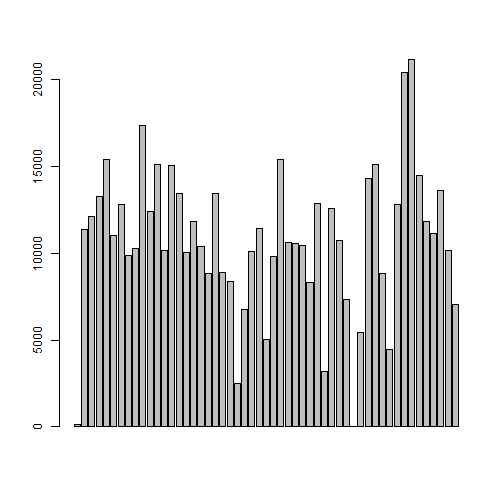
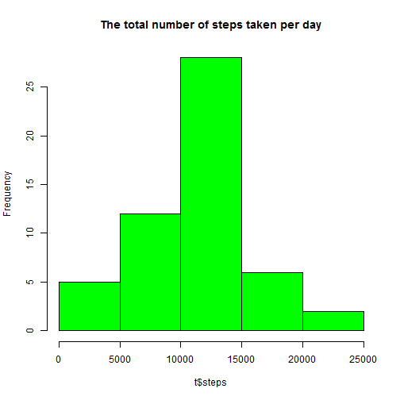
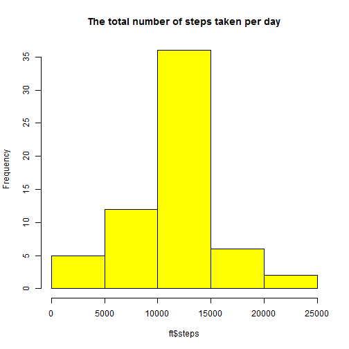

#This markdown file is for the peer assignment 1 of the course "Reproducible Research"


## Loading and preprocessing the data
1. The input data is loaded 


```r
    unzip("./activity.zip")
    adata<- read.table("activity.csv", header= TRUE, sep= ",")
```

2. The date is transfomred to date format


```r
    adata$date <- as.Date(adata$date, "%Y-%m-%d")
```
    

## What is mean total number of steps taken per day?

1. The total number of steps for each date is calculated and plotted using barplot

```r
    t<- aggregate(. ~ date, data= adata, FUN=sum)
    barplot(t$steps)
```

 

2. A histogram of the total number of steps taken is made per day


```r
    hist(t$steps, main= 'The total number of steps taken per day', col= 'Green')
```

 


3. The mean and median of the steps taken per dat are calcuate and displayed below:


```r
    mean(t$steps)
```

```
## [1] 10766.19
```

```r
    median(t$steps) 
```

```
## [1] 10765
```

##What is the average daily activity pattern?

1. A time series plot of the 5-minute interval and the number of steps taken across all days is made


```r
    time_series <- tapply(adata$steps, adata$interval, mean, na.rm = TRUE)
    plot(row.names(time_series), time_series, type = 'l', xlab = '5-min interval', 
     ylab = 'Average across all days', main = 'Average number of steps taken', col= 'Blue' )
```

 

2. The time interval, on average across all days in the dataset with the maximum number os steps

```r
    names(which.max(time_series))
```

```
## [1] "835"
```

##Imputing missing values
1. Calculate and report the total number of missing values in the dataset (i.e. the total number of rows with NAs)

```r
    md<- adata[is.na(adata$steps), ] 
    NROW(md)
```

```
## [1] 2304
```
    
2. The mean value of each time interval is used to replace the NA value in any entry that exisits.
3. A new dataset that is equal to the original dataset but with the missing data filled in is created


```r
    fa_data<- adata
    i<- numeric()
    interval<- list(adata$interval)
    mn<- as.data.frame(aggregate(adata$steps, data= adata, by= interval ,FUN= mean , na.rm= TRUE))
    names(mn)<- c('interval', 'mean_steps')
    
    for (i in 1:nrow(adata)){
      if (is.na(adata[i, ]$steps))
          fa_data[i, 1]<- mn[which(mn$interval== adata[i,3]), 2]
    }
```


4. A histogram of the total number of steps taken each day is plotted. The mean and median total number of steps taken per day are reported which are different from the first part of the assignment. 


```r
    ft<- aggregate(. ~ date, data= fa_data, FUN=sum)
    hist(ft$steps, main = 'The total number of steps taken per day', col= 'Yellow')
```

 

```r
    mean(ft$steps)
```

```
## [1] 10766.19
```

```r
    median(ft$steps) 
```

```
## [1] 10766.19
```

According to the results, the is no difference between the mean of the total number of taken steps between the original data and the data with NAs filled in with mean number of steps per time interval. The median values are different but the difference is so trivial. 


## Are there differences in activity patterns between weekdays and weekends?

1. Create a new factor variable in the dataset with two levels - "weekday" and "weekend" indicating whether a given date is a weekday or weekend day.


```r
    dayl <- vector()
    for (i in 1:nrow(adata)) {
        if (weekdays(adata[i, 2]) == "Saturday" || weekdays(adata[i, 2]) == "Sunday") 
            dayl[i] <- "Weekend"
        else 
            dayl[i] <- "Weekday"
        
    }

    adata$dayl <- dayl
    adata$dayl <- factor(adata$dayl)
    sd <- aggregate(steps ~ interval + dayl, data = adata, mean)
    names(sd) <- c("interval", "day_level", "steps")
```


2. A panel plot containing a time series plot (i.e. type = "l") of the 5-minute interval (x-axis) and the average number of steps taken, averaged across all weekday days or weekend days (y-axis) is created. 


```r
    library(lattice)
    with(adata, xyplot(steps ~ interval | day_level, sd, type = "l", layout = c(1, 2), xlab = "Interval", 
    ylab = "Number of steps"))
```

 

##The report ends here
=======
>>>>>>> 80edf39c3bb508fee88e3394542f967dd3fd3270
